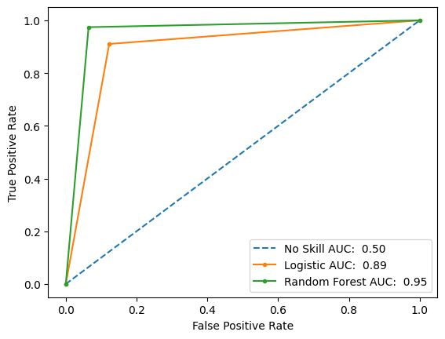
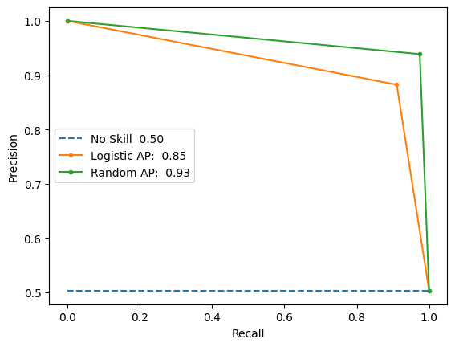

⠀⠀⠀⠀⠀⠀⠀⠀⠀⠀

<div style="display:flex; justify-content: center; align-items: center;">
    <h1 style="font-family: roboto"> Churn Insight</h1> 
</div>

---

## ๋⭑🛸๋⭑ Hackathon NoCountry – Equipo 65

---

### 🧠 Descripción del proyecto

ChurnInsight es una solución de analítica predictiva cuyo objetivo es anticipar la cancelación (churn) de clientes mediante técnicas de Machine Learning.

El proyecto se basa en un dataset de clientes de Netflix, a partir del cual se entrena un modelo capaz de identificar patrones de comportamiento asociados a la cancelación del servicio.
La predicción se expone mediante una API, permitiendo a sistemas externos consultar la probabilidad de churn de un cliente.

---

### 📌 Problema que resuelve

La pérdida de clientes impacta directamente en los ingresos de las empresas de suscripción.
Detectar clientes con alta probabilidad de churn permite:

- Aplicar estrategias de retención tempranas
- Reducir pérdidas económicas
- Mejorar la toma de decisiones basada en datos

---

### 💾 Descripción del dataset

El dataset consta de 14 columnas y 5000 filas.
 Las columnas son las siguientes:
 - customer_id: cadena de caracteres
 - age, años
 - gender: female, male y  other
 - subscription_type: Basic, Premium y Standard
 - watch_hours: horas
 - last_login_days: dias
 - region: Africa, Asia, Europa, North América, Oceanía y  South América
 - device: Desktop,TV, Mobile, Laptop y Tablet
 - monthly_fee: Dólares de USA
 - churned: 1 si y 0 no
 - payment_method: Credit Card, Debit Card, Crypto, Gift Card y Paypal
 - number_of_profiles: Entre 1 y 5
 - avg_watch_time_per_day: horas (watch_hours/last_login_days + 1)
 - favorite_genre: Action, Sci-Fi, Drama,Horror,Romance, Comedy y Documentary

---

## 🧰 Tecnologías utilizadas

### 📊 Análisis exploratorio de los datos (EDA) 

- matplotlib.pyplot
- seaborn
- numpy
- pandas
- scipy

### 🦾 Modelo predictivo

- sklearn
- statsmodels
- pickle


### 📖 Versiones de librerias

- seaborn 0.13.2
- numpy 2.0.2
- Pandas 2.2.2
- sklearn 1.6.1
- scipy 1.16.3
- statsmodels 0.14.6

---

## 📉 Análisis estadístico

El análisis estadístico con ***Chi Cuadrado*** y la ***V de Cramer*** se usa para determinar
si hay asociación significativa entre dos variables categóricas y qué tan fuerte
es esa relación.

El ***coeficiente de correlación de Pearson*** utilizado con el objetivo de medir la dependencia lineal entre dos variables continuas.

Análisis de multicolinealidad a través del método ***Factor de Inflación de la Varianza (VIF)*** entre las variables del modelo de Regresión Logística para evaluar la independencia de las mismas. 

---

## 🚶‍➡️ Pasos del desarrollo del modelo 🚶‍♀️

Dividimos el flujo de trabajo en dos etapas:

                    
                               EDA
                                ⤋
                                ⤋
                                ⤋
                    Desarrollo del modelo predictivo

                    

1. #### Análisis exploratorio del dataset

    El objetivo del EDA es encontrar las variables que tienen relación con el problema a resolver con un modelo de Aprendizaje Automático. Pero, antes hubo que cargar la base de datos y aplicar transformaciones en caso de que hubiera celdas vacías (datos nulos o NAN), tipo de datos incorrectos (una variable numérica que haya sido cargada como cadena de caracteres) o caracteres incorrectos( como un espacio vacío al final de una cadena de caracteres). En este caso, no encontramos errores o datos vacíos por lo cual no hizo falta aplicar ninguna transformación.

    Luego, procedimos al análisis de las variables. Este mismo se hizo en relación al tipo de variable, es decir, las variables categóricas fueron analizadas de manera independiente de las variables numéricas. Pero, en ambos casos utilizamos  herramientas estadísticas y visuales como gráficos de barra, boxplot, mapa de calor, tablas de contingencia, análisis de relación entre las variables y pruebas de hipótesis.

    Además, creamos nuevas variables a partir de las existentes. Por ejemplo, 

    - watch_hours per profiles
    - avg_watch_time_per_day_profile 

    Del mismo concluimos que siete de las trece variables originales tienen más relevancia con la cancelación del servicio de streaming.

    - subscription_type
    - watch_hours
    - last_login_days
    - monthly_fee
    - payment_method
    - number_of_profiles
    - avg_watch_time_per_day

    

    ***Gráfico de barras con la distribución de tipo de suscripción por churn y tasa de cancelación por tipo de suscripción***

    
    
    ***Gráfico de barras apiladas con la distribución de últimos días de acceso por tipo de churn***

    Después de elegir las variables más relevantes generamos un nuevo archivo con solo las variables más influyentes y la variable a predecir, ¡listo para ser usado por nuestro modelo!

2. #### **Desarrollo del modelo de Machine Learning**

   1️⃣ **Ingeniería de Datos y Preprocesamiento Selectivo**

    Para garantizar que el modelo pueda interpretar correctamente la información, implementamos un preprocesamiento diferenciado mediante un ColumnTransformer:

    - Codificación Categórica: Aplicamos One-Hot Encoding a las variables cualitativas, utilizando el parámetro drop='first' para evitar la trampa de variables ficticias.

    - Escalamiento : Utilizamos RobustScaler para normalizar variables con rangos amplios y presencia de valores atípicos.

    - Control de Multicolinealidad: Validamos la independencia de las variables mediante el Factor de Inflación de la Varianza (VIF), asegurando que no exista redundancia que pudiera sesgar los coeficientes del modelo.

   2️⃣ **Modelado y Estrategias de Validación**

    Implementamos un flujo de trabajo basado en algoritmos de aprendizaje supervisado, comparando dos arquitecturas: Random Forest y Regresión Logística. Para evitar errores de manipulación de datos y fugas de información (Data Leakage), integramos todo el proceso en un Pipeline de Scikit-Learn.

    La solidez del modelo se evaluó mediante tres métodos complementarios:

    - Validación Cruzada Estratificada (Stratified K-Fold): Realizamos 5 iteraciones para medir la estabilidad del modelo y su capacidad de generalización.

    - Validación de Retención (Hold-out) y Test Set: evaluamos el rendimiento  en los sets de validación (Validation Set) y de prueba (Test Set) utilizando matrices de confusión y curvas ROC y Precision-Recall.

    3️⃣  **Evaluación de modelos**

    🧪 **Logistic Regression (LR)**
    
    En la validación inicial, el modelo LR mostró un desempeño equilibrado, siendo altamente efectivo para capturar al 91% de los clientes en riesgo, con una tasa de falsas alarmas de solo el 13%.
    

     | **Clase** | **Precision LR** | **Recall LR** | **F1-score LR** |   
     |-----|-----------|--------|----------|
     | 0   | 0.91      | 0.87   | 0.89     |
     | 1   | 0.87      | 0.91   | 0.89     |

        
    La validación cruzada ($k=5$) confirmó la estabilidad del modelo con una desviación estándar mínima ($\pm 0.02$). Al enfrentar los datos de prueba, la sensibilidad (recall) incluso mejoró a 0.93, demostrando que el modelo no presenta sobreajuste (overfitting) y es capaz de generalizar sus predicciones ante datos nuevos de manera robusta.
        
    | **Métrica** | **Validación Cruzada LR** | **Prueba LR** |
    |:-----------:|:----------------------:|:----------:|
    | Precision   | 0.89 ± 0.02            | 0.88       |
    | Recall      | 0.91 ± 0.02            | 0.93       |

    
    🌲 **Random Forest (RF)**

    El modelo de Random Forest exhibió métricas sobresalientes, consolidándose como la opción de mayor capacidad predictiva bruta. Su principal fortaleza es un Recall de 0.98, ideal para una estrategia donde el costo de "perder" un cliente es crítico.

     | **Clase** | **Precision RF** | **Recall RF** | **F1-score RF** |
    |:---------:|:----------------:|:-------------:|-----------------|
    | 0         | 0.98             | 0.93          | 0.95            |
    | 1         | 0.93             | 0.98          | 0.95            |

    ***Informe de métricas de RF con datos de prueba: no se colocaron los reportes de la validación inicial y la validación cruzada porque los valores de las métricas son aproximadamente iguales***
    
    📈 **Análisis de Curvas (ROC y Precision-Recall)**

    **Curva ROC**: El modelo LR alcanza un AUC de 0.89, mientras que el RF llega a un 0.95. Esto indica una probabilidad del 89% y 95% respectivamente de clasificar correctamente a un cliente desertor sobre uno leal. La cercanía de ambas curvas a la esquina superior izquierda confirma una alta tasa de aciertos con mínimos falsos positivos.

    

    **Curva Precisión-Sensibilidad**: En ambos modelos, la precisión se mantiene notablemente constante incluso al aumentar la sensibilidad. El Puntaje Promedio de Precisión (AP) de 0.85 (LR) y 0.93 (RF) garantiza que las acciones de retención basadas en estos modelos serán altamente rentables, minimizando el desperdicio de recursos en clientes que no pensaban abandonar el servicio.

    
    
    4️⃣ **Modelo seleccionado**

    Como fue expuesto en la sección anterior, ambos modelos funcionan, sin embargo, se seleccionó el modelo LR porque es más sencillo de interpretar. Además, en el análisis de importancia de las variables  los dos algoritmos llegan a la misma conclusión: las tres características más importantes son **watch_hours**, **last_login_days** y **avg_watch_time per day**. Aunque, hay atenuantes en esta última afirmación porque los coeficientes no tienen el mismo valor y el orden tampoco es el mismo.

    Aplicando el modelo de LR a nuestro problema la probabilidad de cancelación del servicio de Netflix es la siguiente:

    $$P(Y=1|X) = \frac{1}{1 + e^{-(\beta_0 + \beta_1X_1 + \beta_2X_2 + \dots + \beta_n X_n)}}$$

    donde  β0  es el intercepto de la regresión y  β1 ,  β2  ...  βn  son los coeficientes de las variables predictoras.

    5️⃣ **Postprocesamiento de los datos**

    Se llevó a cabo el análisis de importancia de las características de los dos modelos y el análisis de los coeficientes de Logistic Regression con la finalidad de caracterizar a los clientes según un perfil determinado.
    
    6️⃣ **Segmentación de los clientes**

    Se dividieron a los clientes en tres perfiles según su probabilidad de cancelación. Estos grupos son:

    - Riesgo bajo.
    - Riesgo medio.
    - Riesgo alto.

    Consideramos que si la probabilidad de bajarse del servicio se coloca en el intervalo 0 - 0.35, el cliente tiene un riesgo bajo de cancelar. En cambio, si la probabilidad se ubica entre 0.35 - 0.70, el cliente tiene un riesgo medio de darse de baja del servicio, mientras que si la probabilidad es mayor de 0.70 el riesgo de cancelar el streaming es alto.

    Como fue mencionado en el apartado 2.4, a partir del resultado de top 5 de rasgos más importantes se procedió a caracterizar a cada grupo, si bien las variables tipo de suscripción y plan de pago no están en este top 5, aún así las tuvimos en cuenta como tener una identificación global de los perfiles de evasión.

    La segmentación facilita la creación de estrategias de retención para cada grupo y el ahorro de costos al implementar tales  campañas.

    7️⃣ **Serialización del modelo y función prototipo de predicción**

    Una vez elegido el modelo y hecha la segmentación de los perfiles, continuamos con la serialización del modelo en formato pkl para dejarlo a disposición de la API de predicción. 

    Además, desarrollamos una función  para probar la Regresión Logística con datos nuevos y dejarla como ejemplo para el equipo backend.

    La función toma como parámetro un diccionario de Python del cliente que se quiere analizar. A continuación un ejemplo de un diccionario con los datos de un cliente hipotético.

    ```
    cliente_ejemplo = {
    "subscription_type": "Standard",
    "watch_hours": 7,
    "last_login_days": 19,
    "monthly_fee": 7,
    "number_of_profiles": 1,
    "avg_watch_time_per_day": 2,
    "payment_method": "Paypal"                            
     }                                                

    ```
        
    Luego esta misma convierte el diccionario en un objeto de Python llamado Data Frame. A partir de este último se calcula la probabilidad de evasión del cliente a través del método de predict_proba del modelo de LR cargado en el pipeline.

    La función devuelve otro diccionario con la etiqueta "va a continuar"/ va a cancelar" junto con la probabilidad de cancelación. A continuación se muestra el resultado de la predicción del cliente hipotético anterior.

     ```

    {
        'prevision': 'Va a continuar', 
    
        'probabilidad': 0.1
    }

      ```
    